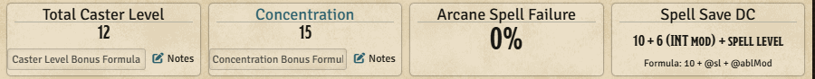
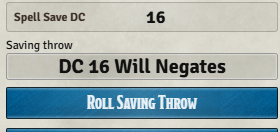

# D35E Spell Save DC

**D35E Spell Save DC** is a small Foundry Virtual Tabletop module for the D35E system. It makes spell save DCs visible where players and GMs already look during play: the spell chat card and the Spells tab on the character sheet.

No extra chat messages. No pop-up windows. No replacement spell workflow. The module reads the D35E system's existing spell data and displays the save DC more clearly.

**Support:** If this module helps your D35E table, donations are optional and support continued maintenance, compatibility testing, release packaging, and documentation.

[](https://github.com/sponsors/SpencerZPoole) [](https://paypal.me/mrpooley92)



## What It Does

- Adds a clear `Spell Save DC: N` row to existing D35E spell chat cards when the spell calls for a saving throw.
- Preserves D35E's native save type, spell resistance, damage, action buttons, and chat-card layout.
- Adds a `Spell Save DC` reference box to each spellbook section on the character sheet's Spells tab.
- Shows the live spellcasting ability modifier in the sheet summary, such as `10 + 6 (INT mod) + spell level`.
- Supports multiple spellbooks by reading each spellbook's configured ability and `baseDCFormula`.
- Does not modify actor, item, spell, or world data.



## Compatibility

- Foundry VTT: minimum 14, verified 14.362
- System: D35E 3.0.2

The module is intentionally D35E-specific and will only run in D35E worlds.

## Installation

In Foundry's **Add-on Modules** setup screen, choose **Install Module** and paste this manifest URL:

```text
https://github.com/SpencerZPoole/d35e-spell-save-dc/releases/latest/download/module.json
```

Then open your D35E world, enable **D35E Spell Save DC** in **Manage Modules**, and reload the world when Foundry prompts you.

## Updating

Foundry checks the stable manifest URL above for updates. Each release manifest points its `download` field to the matching versioned zip asset, for example:

```text
https://github.com/SpencerZPoole/d35e-spell-save-dc/releases/download/v1.1.1/d35e-spell-save-dc-v1.1.1.zip
```

That means Foundry can always find the latest manifest while each installed version still downloads a fixed release archive.

## How The DC Is Displayed

For spell chat cards, D35E already renders the calculated spell save DC. This module promotes that existing value into a more visible row:

```text
Spell Save DC: 18
```

For character sheets, the Spells tab shows a reference formula for each spellbook. For a wizard with INT modifier `6`, the standard D35E formula is displayed as:

```text
10 + 6 (INT mod) + spell level
```

Custom D35E formulas are left in their configured order and made readable by replacing known tokens such as `@sl`, `@ablMod`, and `@cl`.

## Troubleshooting

If a spell does not show a save DC row, check that the spell has a saving throw configured in D35E. Spells with no saving throw, or a save description of `None`, are intentionally skipped.

If a character sheet summary looks wrong, check the spellbook's configured spellcasting ability and `baseDCFormula` in D35E. The module displays those settings; it does not rewrite them.

For deeper troubleshooting, enable the module's **Debug logging** setting. Skipped chat cards and unresolved actor/item data will be logged to the browser console.

## Links

- [Latest release](https://github.com/SpencerZPoole/d35e-spell-save-dc/releases/latest)
- [Issues and bug reports](https://github.com/SpencerZPoole/d35e-spell-save-dc/issues)
- [Changelog](CHANGELOG.md)
- [Security policy](SECURITY.md)
